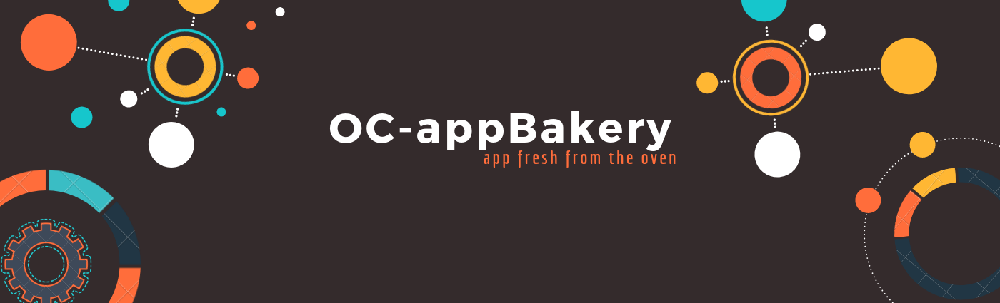
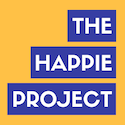
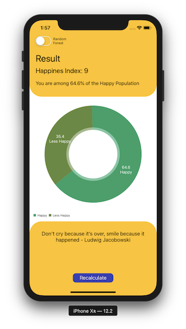
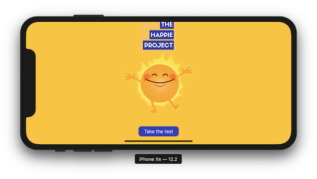
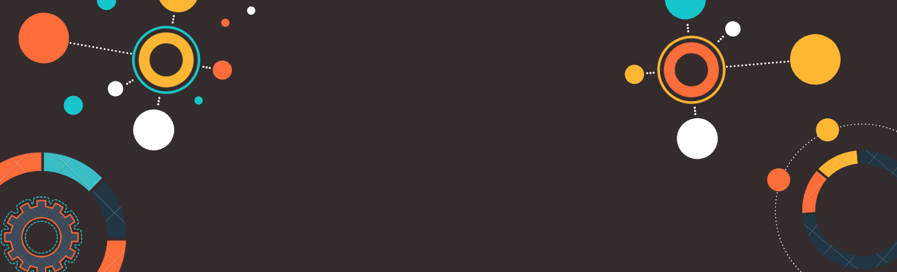

    <h1> The Happie Project </h1>

    

---
## Project Background😁
The background of this project is based on our past experience where we were faced with lots of life problem that forced us to question about what happiness is and what determine someone to be happy

## The Goal 😁
The goal of this project is to create a machine learning app capable of predicting individual happiness index based on real life datasets consists of various aspects of life

    

## Data😁
The data for the project is taken from the questionnaire that we prepare by ourselves and share it through social media (Whatsapp)

## Features 😁
* Predicting happiness index
* Available in 2 prediction mode:
    1. Logistic Regression (Default)
    2. Random Forest Regressor
* Get daily tips to increase your happiness level
* Available in all iPhone

## Requirement 😁
To run this project, you will need:
* Pandas
* Numpy
* Matplotlib
* Seaborn
* Scikit-Learn
* CoreMLTools
* Swift 4
* XCode 10

---
Odji Chrissy 📩[satyananda.chrissy@gmail.com](mailto:satyananda.chrissy@gmail.com)

[Linkedin](www.linkedin.com/in/chrissysatyananda) | [Github](https://github.com/odjichrissy)

